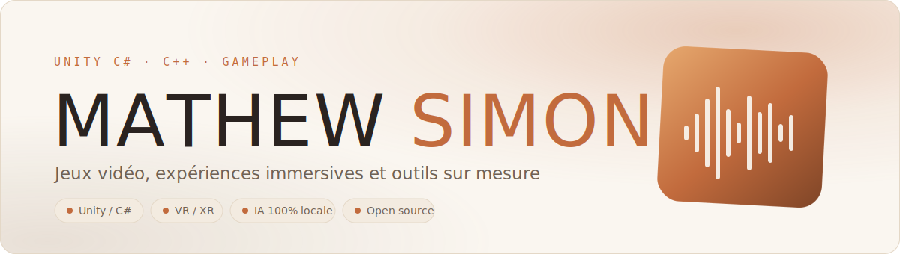

  

  
  
  

 

Développeur **Unity** spécialisé dans la conception de jeux vidéo et d'expériences immersives.
Je travaille aussi bien le gameplay que l'optimisation, la connexion au matériel physique et l'intégration d'IA locale.

Actuellement **lead développeur** sur une installation immersive ouverte au public à Paris, et créateur d'outils que je publie en open source.

 

## Sélection de projets

| Projet | Ce que c'est | Stack |
| --- | --- | --- |
| **[Pirate Experience](https://mathewsimon.tech/fr/projects/pirate-experience)** | Action game immersif à Paris, 6 salles, 2 à 6 joueurs. Lead dev sur la création des jeux et leur connexion au matériel réel. | Unity · C# · Matériel interactif |
| **[Zone 101](https://mathewsimon.tech/fr/projects/zone-101)** | Arène de jeu immersive : projection interactive, sol réactif, buzzers lumineux, son 5.1. | Unity · C# · IoT |
| **[P'tit Bout de Lumière](https://mathewsimon.tech/fr/projects/ptit-bout-de-lumiere)** | Expérience VR qui rassure les enfants chez le dentiste. Optimisation des performances et pathfinding. | Unity · C# · VR |
| **[Gestion des prix](https://mathewsimon.tech/fr/projects/gestion-des-prix)** | App mobile de stock et de marges pour un client, serveur auto-hébergé et synchronisation temps réel. | PocketBase · Android |
| **[ClipForge](https://mathewsimon.tech/fr/projects/clipforge)** | Découpe une vidéo longue en shorts prêts à publier, avec sous-titres et suivi de visage. 100 % local. | Ollama · GPU |
| **[Color Collapse](https://play.google.com/store/apps/details?id=com.LodennStudio.MergeColor)** | Mon premier jeu mobile publié, sous le label Lodenn Studio. Plus de 3 500 téléchargements. | Unity · C# · Android |

<a href="https://mathewsimon.tech/fr/projects"><b>Voir tous les projets</b></a>

 

## Open source

<table>
<tr>
<td width="50%" valign="top">

### [Hyperwisper](https://github.com/Mathew3585/hyperwisper)

Dictée vocale **100 % hors ligne** pour Windows.
Une touche, on parle, le texte se colle dans l'application active.

Moins d'une seconde entre le relâchement de la touche et le texte affiché, grâce à l'accélération GPU.

`Rust` `Tauri 2` `whisper.cpp` `Vulkan`

</td>
<td width="50%" valign="top">

### [Basilic](https://github.com/Mathew3585/Basilic-Pomodoro_App)

Minuteur **Pomodoro** pensé pour se faire oublier.
Une fenêtre de 260 x 120 dans un coin de l'écran, jamais dans le chemin.

Sans compte, sans télémétrie, toutes les données restent en local.

`Tauri 2` `React 19` `TypeScript`

</td>
</tr>
</table>

Deux outils Unity également publiés sur l'**Asset Store** : [Easy Screenshot Tool](https://assetstore.unity.com/packages/tools/camera/easy-screenshot-tool-296926) (gratuit) et [GhostScriptRemover](https://assetstore.unity.com/packages/tools/utilities/ghostscriptremover-305607).

 

## Ce avec quoi je travaille

  
  
  
  
  
  
  
  
  

**Domaines** : gameplay et systèmes de jeu · VR et XR · optimisation temps réel · connexion au matériel physique · IA et LLM en local

 

## En chiffres

  
  

 

---

  <b>Ouvert aux opportunités.</b> 
  <a href="https://mathewsimon.tech">mathewsimon.tech</a> · <a href="mailto:mathew.simon2004@gmail.com">mathew.simon2004@gmail.com</a>

