

  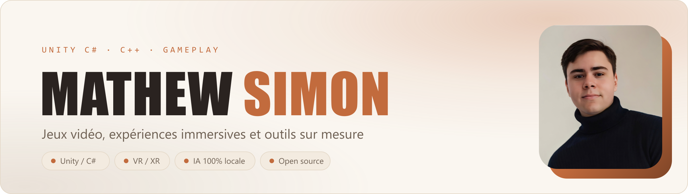

  
  
  

  <b>Lead développeur</b> sur une installation immersive ouverte au public à Paris. 
  Jeux, expériences immersives, outils sur mesure et IA en local, dont une partie en open source.

 

## Projets

<table>
<tr>
<td width="50%" valign="top">
<a href="https://mathewsimon.tech/fr/projects/pirate-experience">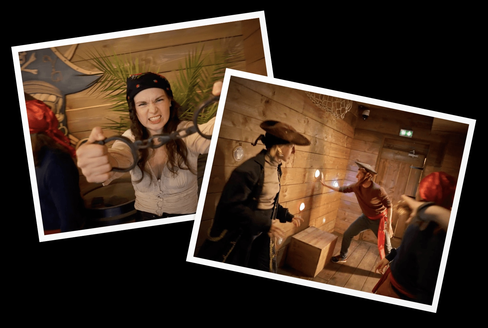</a>

**[Pirate Experience](https://mathewsimon.tech/fr/projects/pirate-experience)**

Action game immersif ouvert à Paris. Six salles, 2 à 6 joueurs. **Lead dev** sur la création des jeux et leur connexion au matériel réel.

`Unity` `C#` `Matériel interactif`

</td>
<td width="50%" valign="top">
<a href="https://mathewsimon.tech/fr/projects/zone-101">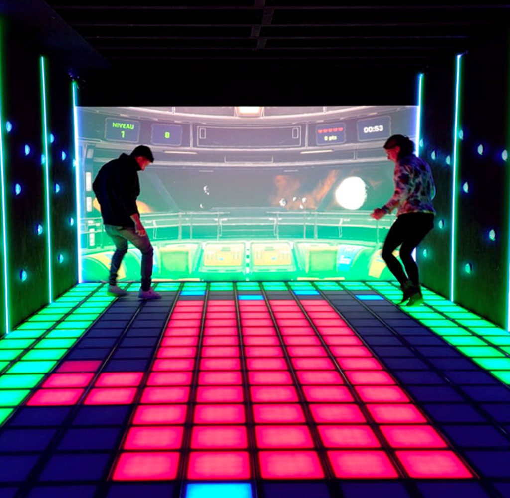</a>

**[Zone 101](https://mathewsimon.tech/fr/projects/zone-101)**

Arène de jeu immersive jusqu'à 6 joueurs : projection interactive de 4 mètres, dalles au sol réactives, buzzers lumineux.

`Unity` `C#` `IoT`

</td>
</tr>
<tr>
<td width="50%" valign="top">
<a href="https://mathewsimon.tech/fr/projects/ptit-bout-de-lumiere">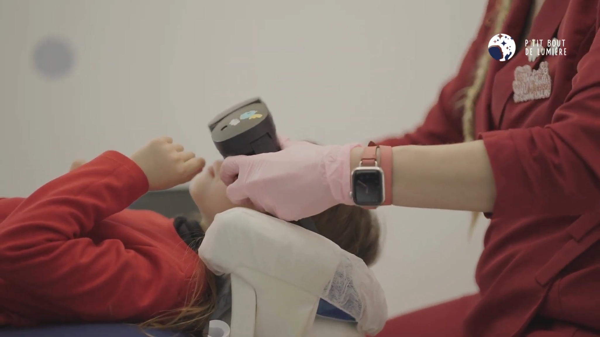</a>

**[P'tit Bout de Lumière](https://mathewsimon.tech/fr/projects/ptit-bout-de-lumiere)**

Expérience VR qui accompagne les enfants pendant leurs soins dentaires. Optimisation des performances et pathfinding.

`Unity` `C#` `VR`

</td>
<td width="50%" valign="top">
<a href="https://mathewsimon.tech/fr/projects/clipforge">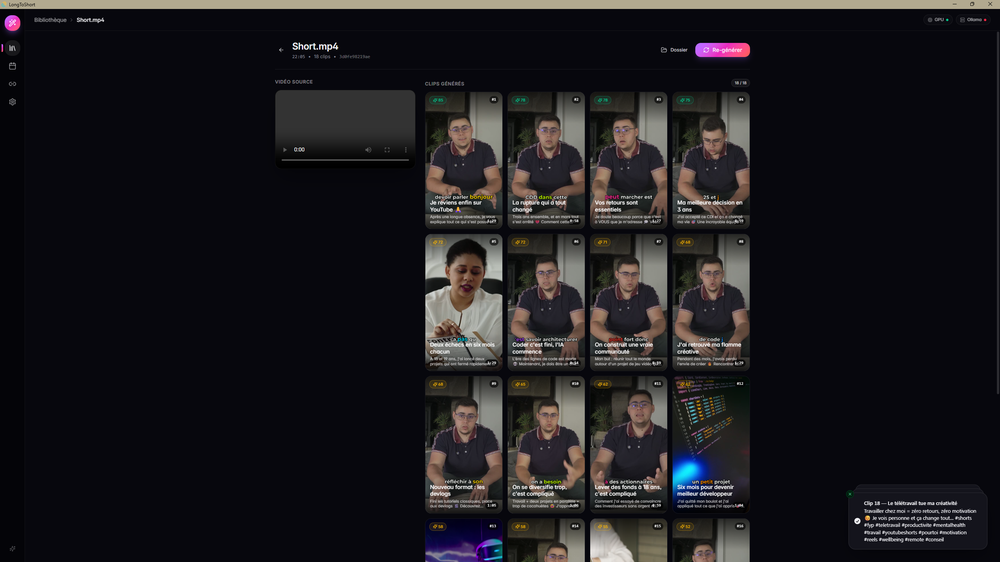</a>

**[ClipForge](https://mathewsimon.tech/fr/projects/clipforge)**

Transforme une vidéo longue en shorts prêts à publier : sous-titres, suivi de visage, titres générés. **100 % local**.

`Ollama` `LLM local` `GPU`

</td>
</tr>
<tr>
<td width="50%" valign="top">
<a href="https://mathewsimon.tech/fr/projects/gestion-des-prix">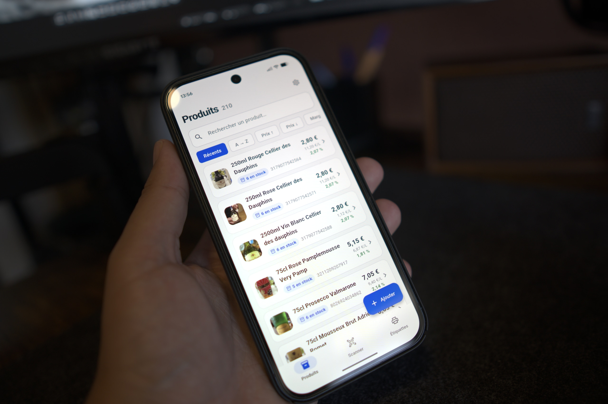</a>

**[Gestion des prix](https://mathewsimon.tech/fr/projects/gestion-des-prix)**

App mobile de stock et de marges pour un client, serveur installé dans ses locaux et synchronisation temps réel.

`PocketBase` `Android` `Open Food Facts`

</td>
<td width="50%" valign="top">
<a href="https://mathewsimon.tech/fr/projects/stream-deck-diy">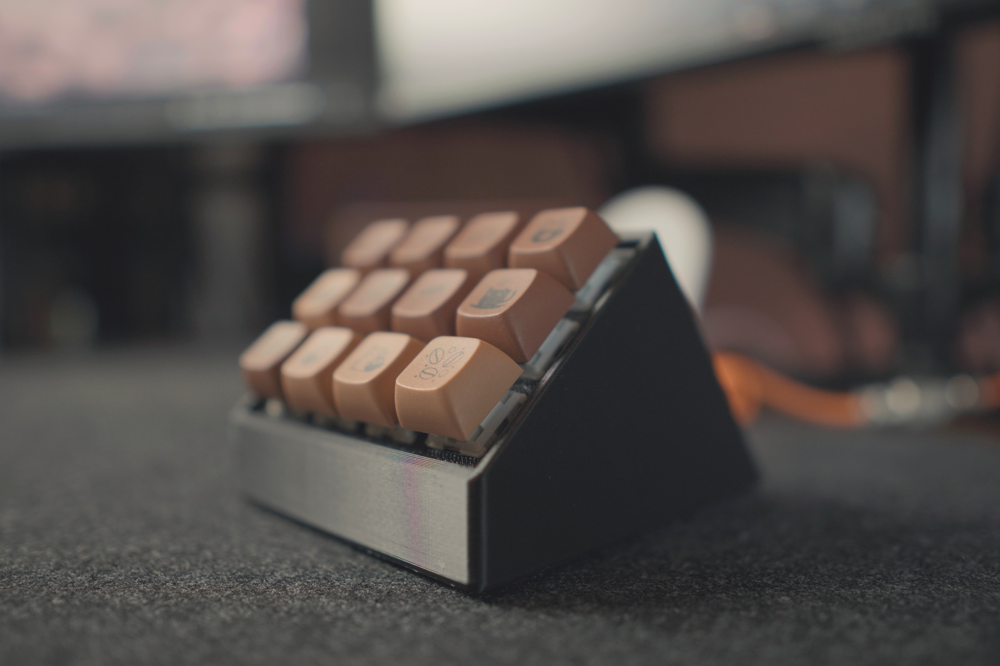</a>

**[Stream Deck DIY](https://mathewsimon.tech/fr/projects/stream-deck-diy)**

Un Stream Deck fabriqué de A à Z : matrice de 12 touches sur ESP32, firmware maison et application de bureau pour piloter OBS.

`ESP32` `C++` `Tauri`

</td>
</tr>
</table>

  

 

## Open source

<a href="https://github.com/Mathew3585/hyperwisper">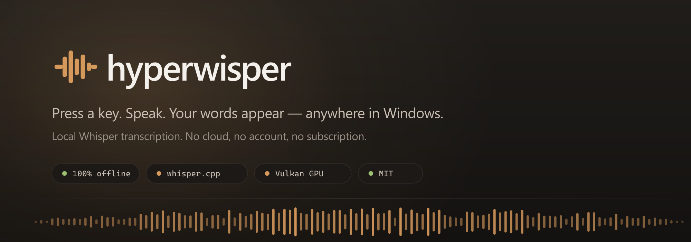</a>

**[Hyperwisper](https://github.com/Mathew3585/hyperwisper)** est une application de **dictée vocale 100 % hors ligne** pour Windows. On presse une touche, on parle, et le texte se colle dans l'application active. Moins d'une seconde entre le relâchement de la touche et le texte affiché, grâce à l'accélération GPU via Vulkan.

  
  
  
  
  

 

<a href="https://github.com/Mathew3585/Basilic-Pomodoro_App">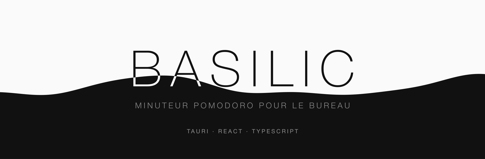</a>

**[Basilic](https://github.com/Mathew3585/Basilic-Pomodoro_App)** est un minuteur **Pomodoro** pensé pour se faire oublier : une fenêtre de 260 x 120 dans un coin de l'écran, toujours visible mais jamais dans le chemin. Sans compte, sans télémétrie, toutes les données restent en local.

  
  
  
  

 

## Publié ailleurs

<table>
<tr>
<td width="33%" valign="top">

**[Color Collapse](https://play.google.com/store/apps/details?id=com.LodennStudio.MergeColor)**

Mon premier jeu mobile publié, sous le label Lodenn Studio. Plus de **3 500 téléchargements** sur Google Play.

</td>
<td width="33%" valign="top">

**[Easy Screenshot Tool](https://assetstore.unity.com/packages/tools/camera/easy-screenshot-tool-296926)**

Outil Unity gratuit pour capturer des screenshots en un clic. Compatible Built-in, URP et HDRP.

</td>
<td width="33%" valign="top">

**[GhostScriptRemover](https://assetstore.unity.com/packages/tools/utilities/ghostscriptremover-305607)**

Outil Unity qui nettoie les références de scripts manquants d'un projet, en un clic.

</td>
</tr>
</table>

 

## Ce avec quoi je travaille

  
  
  
  
  
  
  
  
  
  
  

**Domaines** : gameplay et systèmes de jeu · VR et XR · optimisation temps réel · connexion au matériel physique · IA et LLM en local

 

## Aussi, hors du code

<table>
<tr>
<td width="50%" valign="top">
<a href="https://mathewsimon.tech/fr/projects/clavier-custom">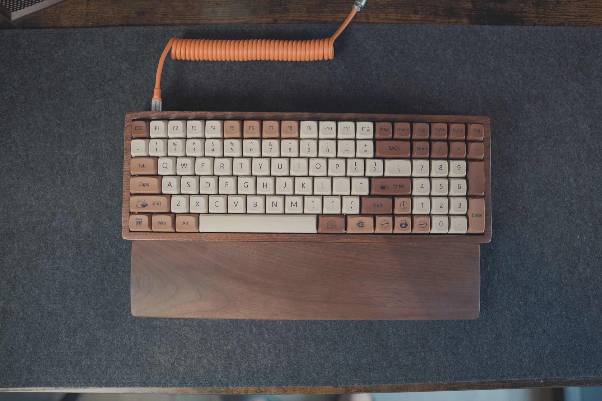</a>

**[Clavier custom](https://mathewsimon.tech/fr/projects/clavier-custom)**

Mon premier clavier monté à la main : 1,2 kg, case en chêne massif, switches hot-swap.

</td>
<td width="50%" valign="top">
<a href="https://mathewsimon.tech/fr/projects/immersicase">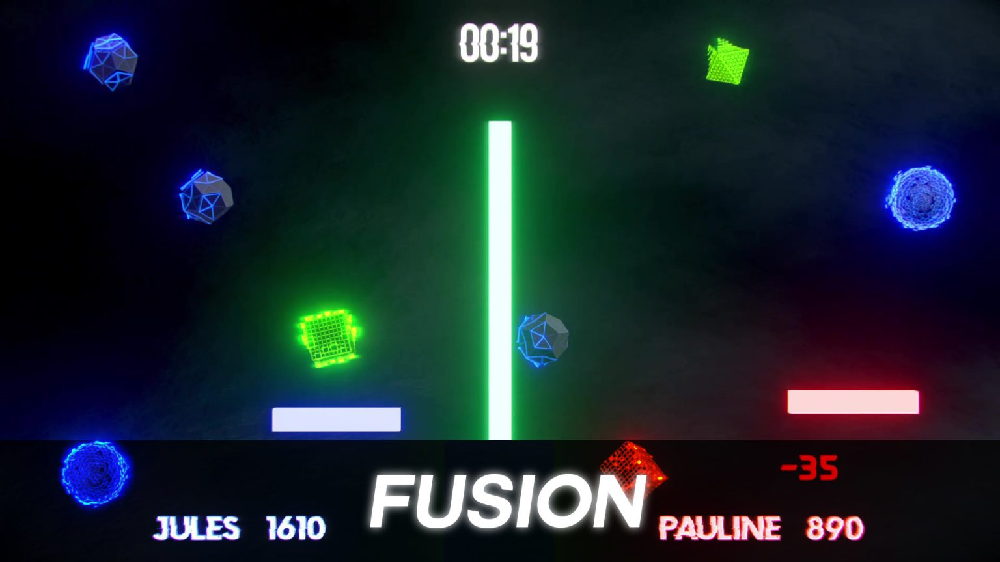</a>

**[Immersicase](https://mathewsimon.tech/fr/projects/immersicase)**

Valise de projection interactive : des mini-jeux contrôlés au corps, installés en moins de 2 minutes.

</td>
</tr>
</table>

 

---

  <a href="https://mathewsimon.tech"><b>mathewsimon.tech</b></a> · <a href="mailto:mathew.simon2004@gmail.com">mathew.simon2004@gmail.com</a> · <a href="https://www.linkedin.com/in/mathew-simon-ab18b4250/">LinkedIn</a>

